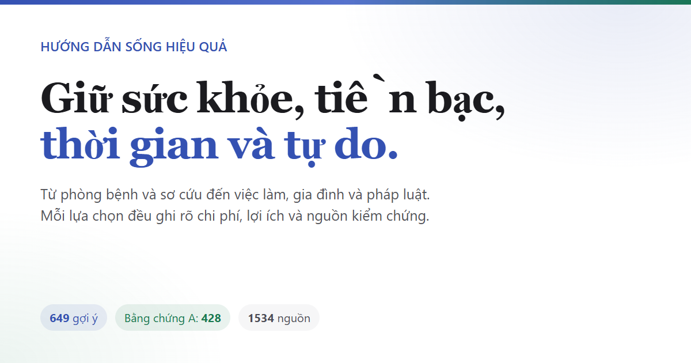
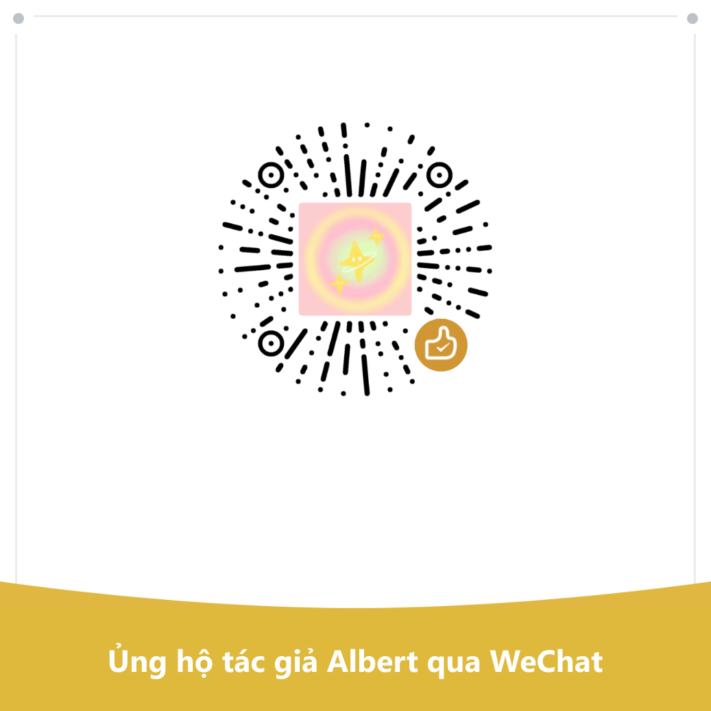

<div align="center">



# Hướng dẫn cuộc sống tiết kiệm chi phí

Nó nói về cách sống lâu, cách giảm bệnh tật, và cách cứu người khi xảy ra tai nạn. Nó nói về cách chi tiêu ít hơn một cách không cần thiết, những điều có thể dẫn đến lừa đảo và kiện tụng. Nó nói về những gì bạn có thể nhận được khi không có việc làm hay tiền bạc, và những thủ tục bạn cần trải qua để mở cửa hàng, khởi nghiệp hoặc vận hành một trang web. Nó cũng nói về hẹn hò, kết hôn, có con, đi nước ngoài và học nghề. Hệ thống pháp lý, y tế và an sinh xã hội được viết theo các quy định hiện hành của Trung Quốc đại lục <br>
649 đề xuất, mỗi đề xuất chỉ rõ những gì đã chi tiêu, những gì được thu hồi và mức độ mạnh mẽ của bằng chứng, với các nguồn chỉ trích dẫn các bài báo khoa học và tài liệu chính thức. 

Bạn không cần phải làm mọi thứ: đây là danh sách các lựa chọn sao lưu được sắp xếp theo hiệu quả chi phí, không phải danh sách nhiệm vụ—chỉ chọn một hoặc hai mục tiêu nữa, nhưng chính tác giả không làm hầu hết chúng. 

[! [Tìm kiếm trực tuyến] (https://img.shields.io/badge/%E5%9C%A8%E7%BA%BF%E6%A3%80%E7%B4%A2-%E7%82%B9%E8%BF%99%E9%87%8C%E6%89%93%E5%BC%80-3451b2?style=flat-square)] (https://eternity4719.github.io/HowToLiveBetter/)
[! [Bài báo] (https://img.shields.io/badge/%E6%9D%A1%E7%9B%AE-649%20%E6%9D%A1-18794e?style=flat-square)] (#目录)
[! [Phân loại bằng chứng] (https://img.shields.io/badge/%E8%AF%81%E6%8D%AE%E5%88%86%E7%BA%A7-A%20428%20%C2%B7%20B%20171%20%C2%B7%20C%2050-915930?style=flat-square)] (#证据分级)
[! [Tài liệu gốc] (https://img.shields.io/badge/%E5%8E%9F%E5%A7%8B%E6%96%87%E7%8C%AE-1531%20%E6%9D%A1%E9%93%BE%E6%8E%A5-565a5f?style=flat-square)] (tài liệu/Hồ sơ xác minh/)
[! [Giấy phép] (https://img.shields.io/badge/%E8%AE%B8%E5%8F%AF-CC%20BY%204.0-565a5f?style=flat-square)] (#许可)

### [Mở trang tìm kiếm trực tuyến](https://eternity4719.github.io/HowToLiveBetter/) · [Để AI trả lời theo sách (kỹ năng)] (kỹ năng/hướng dẫn quyết định cuộc sống/README.md)

Kỹ năng trợ lý AI hỗ trợ Claude Code và Codex. Sau khi cài đặt, nó trực tiếp hỏi "Bạn có ký cho người bảo lãnh của bạn bè hay không?" Nó kiểm tra mục trong sách trước khi trả lời, chỉ rõ mục và mục đó đến từ đâu. 

<table>
<tr><td align="right"> <b>download</b></td><td align="left">

[PDF] (https://github.com/eternity4719/HowToLiveBetter/releases/download/epub-latest/HowToLiveBetter.pdf) · [EPUB] (https://github.com/eternity4719/HowToLiveBetter/releases/download/epub-latest/HowToLiveBetter.epub) · [Tệp Đơn Hàng Ngoại tuyến (HTML)] (https://github.com/eternity4719/HowToLiveBetter/releases/download/epub-latest/HowToLiveBetter.html)

</td></tr>
<tr><td align="right"> <b><</b></td>td align="left">

[Nội dung] (#目录) · [Thuật ngữ] (#读懂数字术语表) · [Hồ sơ xác minh] (tài liệu/Hồ sơ xác minh/)

</td></tr>
<tr><td align="right"> <b>văn bản dài</b></td><td align="left">

[Hôn nhân có đáng không?] ] (tài liệu/Hôn nhân Worthwhile.md) · [Danh sách kiểm tra thiết bị khẩn cấp gia đình] (tài liệu/Thiết bị khẩn cấp gia đình Checklist.md) · [Có nên dừng lại khi gặp người lạ không?. ] (docs/Bạn có nên dừng lại khi gặp người lạ?) · [Bạn cần những chứng chỉ gì để vận hành một nền tảng] (docs/Những chứng chỉ cần thiết để xây dựng một Platform.md) · [Đồng hồ sinh học và ca đêm] (docs/Đồng hồ sinh học và Shift.md đêm) · [Phải làm gì sau khi bị sa thải] (docs/Phải làm gì sau khi được đưa ra Off.md) · [Những việc cần làm trước và sau khi trẻ chào đời] (docs/Những việc cần làm trước và sau khi trẻ Birth.md) · [Sau khi mới được chẩn đoán mắc bệnh mãn tính] (docs/Sau khi mới được chẩn đoán mắc bệnh mãn tính Disease.md)

</td></tr>
<tr>< td align="right" > <b>< các ngôn ngữ khác</b></td> > td align="left"

[Tiếng Anh] (https://dlgrv.github.io/HowToLiveBetter/en/) · [Русский] (https://dlgrv.github.io/HowToLiveBetter/ru/) · [Tiếng Tây Ban Nha] (https://dlgrv.github.io/HowToLiveBetter/es/) · [Bồ Đào Nha] (https://dlgrv.github.io/HowToLiveBetter/pt/), [dlgrv](https://github.com/dlgrv) Dịch bảo trì ([kho lưu trữ](https://github.com/dlgrv/HowToLiveBetter))
</td></tr>
<tr><td align="right"><b>衍生工具</b></td><td align="left">

[howtolivebetter.net] (https://howtolivebetter.net/),[littleben](https://github.com/littleben) 做的打勾清单:加待办、标记做到没有、收藏

</td></tr>
</table>

<sub>其他语言和衍生工具由他人维护,内容可能落后,以本仓库中文原文为准。 </sub>

</div>

--- 

## 这本书想回答的问题

| 问题 | 去哪看 |
| --- | --- |
| 几乎不花钱，就能明显降低早死概率的事有哪些？ | [1. 不要早死](book/01-不要早死.md) |
| 抽烟、喝酒、久坐、熬夜到底折寿多少，烟和酒具体怎么戒，家常食用油怎么选怎么用？ | [2. 不要慢慢死](sách/02-不要慢慢死.md) |
| 每天精力不够用、总被打断，怎么改？ | [3. 不要浪费精力](sách/03-不要浪费精力.md) |
| 时间都花哪去了，怎么少做无收益的事，拖延怎么治？ | [4. 不要浪费时间](sách/04-不要浪费时间.md) |
| 攒下的钱该怎么放，才不被利息、费率和骗局吃掉？ | [5. 不要浪费钱](sách/05-不要浪费钱.md) |
| 哪些保健品、体检套餐、智商税可以直接不买？ | [6. 反面清单](sách/06-反面清单.md) |
| 失业了、被欠薪了、身上没钱了，能领什么、去哪求助？ | [7. 没钱的时候怎么活](book/07-没钱的时候怎么活.md) |
| 彩礼、婚前房产、恋爱期间的大额转账算谁的，被人报案指控或捏造事实举报时第一步做什么，自己惹了事主动去说能减多少刑，事后能不能追究和索赔？ | [8. 法律与财产安全](book/08-别把自己搭进去.md) |
| 哪些「兼职」和顺手的小事会让普通人变成刑事被告？ | [9. 普通人容易踩的法律红线](book/09-普通人容易踩的法律红线.md) |
| 追人该广撒网还是死磕一个，异地恋能不能成，领证要带什么？ | [10. 恋爱和结婚划不划算](book/10-恋爱和结婚划不划算.md) |
| 写哪些代码、接哪些单会被判刑？ | [11. 程序员和技术人容易踩的红线](book/11-程序员和技术人容易踩的红线.MD) |
| 借钱开店、开公司之前最该先想清楚什么？ | [12. 创业与做生意](book/12-创业与做生意.md) |
| 有人倒地没了呼吸、大出血、火灾、迷路，先做什么？ | [13. 紧急情况:先做什么](book/13-紧急情况.md) |
| 账号被盗、手机丢了，第一步做什么？ | [14. 账号与信息安全](book/14-账号与信息安全.md) |
| 押金被扣、房东赶人、长租公寓暴雷怎么办，想搬去乡下住能不能买农村的房？ | [15. 租房与买房](sách/15-租房与买房.md) |
| 确诊慢性病之后，长期该怎么管、怎么少花钱？ | [16. 得了慢性病之后怎么活](book/16-得了慢性病之后怎么活.MD) |
| 老人的监护、遗嘱和钱该怎么提前安排？ | [17. 家里有老人](sách/17-家里有老人.md) |
| 生孩子能领什么、要占掉多少时间和钱？ | [18. 养孩子划不划算](book/18-养孩子划不划算.md) |
| 加班费、年休假该怎么算，被裁该拿多少补偿，上班受了伤怎么认定和拿钱？ | [19. 在职、离职和工伤](book/19-在职离职和工伤.md) |
| 孩子刚出生，最要紧的几件事是什么？ | [20. 刚出生的孩子怎么带](book/20-刚出生的孩子怎么带.md) |
| 哪些国家现在别去，出事了使领馆管到哪一步？ | [21. 出国、旅行与境外安全](Book/21-出国旅行与境外安全.MD) |
| 去 KTV、网吧、密室怎么不踩坑,压力大时做什么最有用? | [22. 怎么放松:娱乐场所和减压](book/22-怎么放松.md) |
| 学电焊、学英语、考证，哪些真的回本，怎么学才省时间，职称从哪里报、值不值？ | [23. 学什么技能划算](book/23-学什么技能划算.md) |
| 同一个病在社区看和在三级医院看差多少钱，伤得很重时是挂号排队还是找急诊分诊台，治完要不要做伤残鉴定、办残疾人证？ | [24. 看病:怎么少花钱少走弯路](book/24-看病.md) |
| 家里人走了，当时先做什么、哪些钱能取回来、哪些费用可以不交？ | [25. 人走了以后要办什么](book/25-人走了以后要办什么.md) |
| 做个网站或平台收钱，要办哪些证、服务器放哪？ | [26. 做一个网站或平台](book/26-做一个网站或平台.md) |
| 怀孕了、要生了，什么时候做什么，出院前要办哪些证？ | [27. 怀孕和生产](book/27-怀孕和生产.md) |
| 想减肥、想变好看，哪些做法会把身体搞坏？ | [28. 别为了外形把身体搞坏](book/28-别为了外形把身体搞坏.md) |
| 亲人走了、被裁了、拿到重病诊断，头几个月最要紧的是什么？ | [29. 遭遇重大打击之后](sách/29-遭遇重大打击之后.md) |
| 孩子上学以后，哪些身体和心理的事不能等到考完再说？ | [30. 上学以后的孩子](book/30-上学以后的孩子.md) |
| 十八岁之后除了读书和打工还有哪几条路，各自的门槛是什么？ | [31. 十八岁之后有哪几条路](book/31-十八岁之后有哪几条路.md) |
| Khi du học, làm thế nào tình trạng visa có thể được coi là nguyên vẹn? Bằng tốt nghiệp này có được công nhận khi trở về không? | [32. Du học: Danh tính, Công việc bán thời gian, Bảo hiểm và Chứng nhận trở về nước] (sách/32-Abroad.md học tập) |
| Nếu bạn hoặc gia đình bị khuyết tật, bạn nên phòng ngừa những biến chứng nào trước, bạn có thể xin trợ cấp gì, và về việc học, việc làm và quyền giám hộ thì sao? [33. Cách sống sau khuyết tật] (sách/33-Cách sống sau Disability.md) |
| Thuốc cảm, thuốc hạ sốt, và thuốc dạ dày nên mua và tự uống. Loại nào không nên dùng cùng nhau, và loại nào nên tránh, trẻ em, phụ nữ mang thai, người cao tuổi? | [34. Đừng Lo Về Việc Dùng Thuốc Gia Đình] (Sách/34 - Đừng Ăn Uống Trong Medicines.md) |

## Cách phát âm

- **Không cần làm mọi thứ**: Đây là danh sách các lựa chọn được sắp xếp theo hiệu quả chi phí, không phải danh sách nhiệm vụ. Chọn một hoặc hai mục và đếm; để phần còn lại cho sau. "Nói thì dễ hơn làm" là đúng—chính tác giả không làm phần lớn, nên ông ấy ghi lại để có thể tìm khi cần. Nếu bạn muốn tiết kiệm công sức, hãy xem phần "Chỉ muốn thấy những thứ đáng giá nhất" bên dưới. 
- **Muốn AI giúp bạn kiểm tra**: Có một kỹ năng tiếng Trung ([skills/life-decision-guide](skills/life-decision-guide/)) trong kho, có thể cài đặt bằng Claude Code và Codex. Sau khi cài đặt, bạn có thể hỏi trực tiếp 'Bạn đã ký nhận bảo hành của bạn bè chưa?' hoặc 'Có đáng để đi lại hai tiếng mỗi ngày không?' Nó sẽ tìm các mục liên quan trong văn bản chính, sau đó sắp xếp theo phương pháp tính toán của cuốn sách và chỉ ra mục và mục xuất phát. Nếu bạn không tìm thấy, chỉ cần nói là không thể; đừng tự nghĩ ra số. Để biết hướng dẫn, xem [Mô tả thư mục đó] (skills/life-decision-guide/README.md). 
- **Muốn chọn theo tiêu chí**: Mở [Trang Tìm kiếm Trực tuyến] (https://eternity4719.github.io/HowToLiveBetter/), lọc theo từ khóa, chương và mức độ bằng chứng, hoặc lọc theo 'có tốn tiền không, mất bao nhiêu thời gian, có cần kiên trì hay không'—ba tiêu chí này có thể được sử dụng cùng nhau. Nội dung trên trang được lấy trực tiếp từ văn bản chính trong sách/mục lục; khi văn bản chính bị thay đổi, trang sẽ thay đổi tương ứng. 
- **Các mục sẽ hướng dẫn lẫn nhau** (xem Mục 8, Mục 17, v.v.): Trên trang tìm kiếm, loại hướng dẫn này được đánh dấu bằng đường đứt. Nhấp một lần, tiêu đề mục được trỏ và 'Nói rõ ràng' sẽ hiển thị ngay tại chỗ. Nếu bạn muốn lật qua thực sự, nhấn 'Bỏ qua' lần nữa. Mục đó bị ẩn bởi tiêu chí lọc, và trang sẽ tự động xóa bộ lọc. Trên GitHub, bạn không thể nhấp trực tiếp vào văn bản chính, nhưng sau mỗi hướng, sẽ có một mục được trỏ đến (xem mục 18 (Vay tiền và viết giấy nợ rõ ràng)'). Bạn có thể biết mục nào được nhắc đến mà không cần lật qua. 
- **Đọc theo thứ tự**: Các mục trong mỗi phần được sắp xếp từ hiệu quả chi phí cao nhất đến thấp nhất, và chỉ bắt đầu từ vài mục đầu tiên trong mỗi phần. 
- **Muốn đọc ngoại tuyến, muốn gửi cho người khác**: Tải về [HTML tệp đơn ngoại tuyến](https://github.com/eternity4719/HowToLiveBetter/releases/download/epub-latest/HowToLiveBetter.html), toàn bộ cuốn sách, cùng với chức năng tìm kiếm và lọc, đều nằm trong một tệp duy nhất. Chỉ cần nhấp đúp để mở, không cần máy chủ hay internet, và bạn cũng có thể tải lên trực tiếp từ WeChat. 
- **Muốn in hoặc dịch trên điện thoại**: Tải xuống [PDF] (https://github.com/eternity4719/HowToLiveBetter/releases/download/epub-latest/HowToLiveBetter.pdf), định dạng A4, hơn 200 trang, kèm mục lục, số trang và dấu trang, bắt đầu một trang mới cho mỗi phần. 
- **Muốn đọc trên Kindle hoặc các trình đọc khác**: Tải về [EPUB eBook] (https://github.com/eternity4719/HowToLiveBetter/releases/download/epub-latest/HowToLiveBetter.epub), Kindle sẽ gửi qua Gửi đến Kindle. 
- **Cả ba đều được tự động tái tạo sau mỗi lần cập nhật văn bản chính**, và liên kết tải xuống vẫn cố định; Phiên bản chuyển tiếp sẽ không được cập nhật tương ứng; phiên bản trực tuyến sẽ được ưu tiên. 
- **Không hiểu chuỗi số đó**: Mỗi mục có một dòng ghi 'nói thẳng thắn.' Nó dịch các bài nghiên cứu trong cột 'Returns' thành các cụm từ hàng ngày như 'giảm khoảng 20% xác suất tử vong trong cùng khoảng thời gian' hoặc 'bao nhiêu ngày bị giam giữ và phạt bao nhiêu tiền.' Nó chỉ sử dụng nội dung đã ghi trong cột 'Returns', không thêm số mới. Chỉ cần nhìn vào dòng này là đủ để đưa ra quyết định. Cột 'Returns' giữ nguyên tất cả các con số; nếu bạn muốn tự kiểm tra, chỉ cần nhìn vào cột đó. 
- **Chỉ muốn thấy kết luận mạnh nhất**: Kiểm tra cấp bằng chứng A trên trang tìm kiếm, chỉ còn lại 428 mục với số liệu cụ thể từ các phân tích tổng hợp hoặc thử nghiệm lớn. 
- **Chỉ muốn thấy những mục đáng giá nhất**: Đánh dấu vào ô 'Xuất sắc' cho 111 mục không tốn tiền, không mất thời gian, đòi hỏi sự kiên trì và mang lại lợi nhuận cao nhất. Thêm một 'Mục Đổi lại' khác để tạo danh sách ưu tiên theo tiêu chuẩn đó. 
- **Đừng lo lắng khi thấy tiêu đề phần bắt đầu bằng "Đừng"**: Tiêu đề phần nói về những gì phần muốn ngăn chặn (đừng chết sớm, đừng lãng phí thời gian), không phải mọi mục dưới đây đều bảo bạn không được làm. Các hành động thực tế cần làm được ghi trong tiêu đề bài viết, luôn bắt đầu bằng động từ, nên bạn phải nói rõ đó là "phải làm gì" hay "đừng làm." Cả hai loại đều tồn tại trong cùng một phần: Phần 4 bao gồm cả "viết 'kế hoạch làm' thành 'lúc nào, ở đâu, bất cứ điều gì bạn nghĩ đến'" và "đừng xem TV hoặc phát tin tức." Đọc theo tiêu đề bài viết, không cần áp dụng giọng điệu của tiêu đề phần. 

Mỗi gợi ý trông như sau: 

'''giảm giá
### 5. Thay muối tại nhà bằng muối ít natri (muối kali)
- Giá thành: Một túi đắt hơn muối thường vài nhân dân tệ. Bạn có thể thay khi mua để không tốn thêm thời gian. Hương vị gần như giống nhau. 
- Nói thẳng ra: những người từng bị đột quỵ hoặc tăng huyết áp trên 60 tuổi thay thế muối gia đình bằng muối ít natri, giảm khoảng 12% nguy cơ tử vong trong vòng năm năm và thấp hơn khoảng 14% đối với đột quỵ. 
- Lợi ích: Một thử nghiệm ngẫu nhiên gồm hai nhóm được thực hiện ở vùng nông thôn Trung Quốc, với 20.995 người, tất cả đều là bệnh nhân đột quỵ hoặc tăng huyết áp trên 60 tuổi, đã được theo dõi trong 4,74 năm. Kết quả: Nhóm sử dụng muối ít natri có nguy cơ tử vong thấp hơn khoảng 12% (RR 0,88) so với nhóm dùng muối thông thường. Đột quỵ thấp hơn khoảng 14% (RR 0,86). Các sự kiện tim mạch chính giảm khoảng 13% (RR 0,87). 
- Mức độ bằng chứng: A
- 来源:Neal B 等 (2021). Ảnh hưởng của sự thay thế muối lên các sự kiện tim mạch và tử vong. NEJM. https://doi.org/10.1056/NEJMoa2105675
- 备注：争议。 试验对象是高危老人，健康年轻人换盐得到的好处要小得多。 肾功能不全的人，或者正在吃保钾类药物的人，换盐前先问医生。 
```

## 自己跑一份

多数人用不着部署:[在线检索页](https://eternity4719.github.io/HowToLiveBetter/)是现成的,要离线就下[离线单文件 HTML](https://github.com/eternity4719/HowToLiveBetter/releases/download/epub-latest/HowToLiveBetter.html),双击就开。 

真要在自己电脑或服务器上跑： 

'''bash
https://github.com/eternity4719/HowToLiveBetter.git bản sao git
cd HowToLiveBetter
python -m http.server 8000
```

然后浏览器开 'http://localhost:8000/'。 检索页是纯静态的,'README.md' 和 'book/' 就是它的数据,没有后端、没有数据库、不用装依赖;把整个目录丢给任何静态服务器(Nginx、GitHub Pages、对象存储)效果一样。 注意 'index.html' 必须经 http 打开,直接双击本地文件会空白——浏览器不许网页读本地文件,那种场景请用上面的离线单文件版。 

想自己生成三样电子版(平时用不着,Release 里的就是自动生成的): 

'''bash
CD tools/epub & npm ci & npm run build # EPUB
node tools/offline/build.mjs # 离线单文件 HTML
node tools/pdf/build.mjs # PDF,另需 pandoc ≥ 3.1 和 typst ≥ 0.13
```

产物都在 'dist/'。 

## 四种资源

这本书想帮你多留住的不只是寿命，一共四样东西： 

- **寿命**：活得更久，少死于本来可以避免的事
- **时间与精力**：活着的时间不花在没有回报的事上，每天的注意力和体力少被白白耗掉
- **金钱**：少花冤枉钱，把钱花在收益确定的地方
- **人身自由**：不因为不知道一条红线，把自己送进拘留所或者看守所

每一条建议都回答两个问题：要花掉什么（钱/时间/精力/毅力），能换回什么（总死亡率变化 / 特定死因下降 / 时间与精力节省 / 金钱节省 / 保障与人身自由）。 条目按性价比排，不按类别排：几乎不花什么成本、换回的好处又大的，放在最前面。 

**一条建议的好处落在谁身上，是分档的。 ** 按「这份好处将来有多大可能回到你自己身上」从高到低：① **你自己**；② **配偶和直系亲属**（父母、子女、祖父母外祖父母、孙子女外孙子女）；③ **朋友、同事和其他亲属**——互惠关系，帮出去的将来可能回来；④ **陌生人**——最低一档，但不是零：回报的概率小，而且你不了解对方性格，还有被讹、被反咬、被报复的一面。 不同档不合并计算，写到第 ④ 档时好处和风险一起写。 

急救那一节照这个读：中国 38,227 例院外心脏骤停里 79.2% 发生在家里，学按压首先是为了按在自家人身上；「看到有人溺水自己不下水」「撞见斗殴别上手拉架」这类规则本身就是自保规则，防的是你从旁观者变成第二个伤者。 对陌生人要不要出手是你自己的权衡，条目会把免责条款、自保动作和风险面都写清楚，不替你把它算成非做不可的理由。 

死亡率的数字、时间精力的数字、金钱的数字和法律后果，各算各的，不互相折算。 这四样对应检索页上那四个「换回什么」，彼此之间不比大小。 

## 证据分级

每条建议都标注证据等级： 

| 等级 | 含义 |
| --- | --- |
| A | 有具体数字可查,出处是多项研究合并起来的荟萃分析、跟踪很多人很多年的大型队列,或者随机分组的试验(RCT),能说出降了多少(HR、RR、下降百分比) |
| B | 有研究支持，但说不出一个确切数字；或者只有小样本、单独一项研究撑着 |
| C | 作者自己的经验，或者大家公认的做法，没有直接的研究文献 |

全书 649 条中 A 级 428 条、B 级 171 条、C 级 50 条,另有 65 条标注了争议、3 处标注了 TODO 待核实。 有争议的 A/B 级条目会标注「争议」并列出反方证据。 所有来源只引原始文献(期刊论文附 DOI 或 PubMed 链接,或 WHO/CDC/国家统计局等官方机构报告),不引二手转述。 不确定的数字标「待核实」。 

A 级只说明「有具体数字、出处可核」，不说明这个数字一定是因果。 A 级里既有随机分组的试验，也有只跟踪记录、不分组的研究，后者分不清是这件事起了作用，还是做这件事的人本来就更健康。 哪一种看收益栏：写着「随机分成两组」的是前者，写着「只记录、不分组」的是后者。 法律和政策类条目的 A 级，指的是引到了法条或官方文件原文。 

收益栏和说人话里的百分比，多数是比没做的人低几成，不是每一百人里少几个。 同样低 12%，本来风险就高的老人少掉的死亡人数，远多于本来风险就很低的年轻人。 所以先看说人话里写的是哪些人，再看那个百分比。 

## 性价比档
Mức độ bằng chứng chỉ trả lời câu hỏi 'Con số này có đáng tin cậy không?' và không trả lời 'Vấn đề này có đáng làm không?' Vì vậy, mỗi mục cũng bao gồm hai yếu tố bổ sung: mức lợi ích (lợi ích lớn đến mức nào) và chất lượng (loại hàng hóa được trao đổi). Trên trang tìm kiếm, hai mục này cộng với ba chi phí được kết hợp để tạo thành hồ sơ chi phí - hiệu suất: 

| Kích thước | Giá trị | Cách xác định |
| --- | --- | --- |
| Tiêu chuẩn | Tuổi thọ giao dịch / tiền / thời gian và năng lượng / tự do cá nhân | Hãy xem giao dịch chính này nhận lại được gì. **Đừng so sánh giữa các tiêu chuẩn khác nhau**; "tỷ lệ tử vong tổng giảm 12%" và "tiết kiệm 500 nhân dân tệ mỗi năm" không cùng một thang điểm; không có người chiến thắng rõ ràng |
| Thang thu nhập | Lớn / Trung bình / Nhỏ | Hãy cố gắng làm theo phần 'Lợi nhuận' của bài viết, theo các ranh giới đã đặt trước, không dựa trên trực giác: Giảm tuổi thọ theo một tỷ lệ nhất định (≥ 20% là lớn, 10–20% là trung bình, <10% là nhỏ, hoặc chỉ đo mức trung bình mà không đo kết quả cuối cùng); Đổi tiền theo số lượng (hàng chục nghìn là lớn, hàng trăm đến hàng nghìn là trung bình, hàng chục nghìn là nhỏ); Tự do cá nhân được đánh giá bằng hậu quả (tránh trách nhiệm hình sự là cao nhất, tránh bị giam giữ hoặc phạt hành chính là trung bình, tránh tranh chấp dân sự là nhỏ); Tiết kiệm thời gian và công sức là quan trọng nhất (tiết kiệm giờ hàng ngày là lớn, tiết kiệm hàng tuần là trung bình, chỉ tiết kiệm một lần là nhỏ) |
| Hiệu suất chi phí | Rất cao / Cao / Trung bình | Lợi ích lớn, cả ba chi phí đều bằng 0 = Rất cao; Lợi ích lớn, chi phí thấp, hoặc lợi ích trung bình, chi phí bằng 0 = Cao; Còn lại = Trung bình |

Trong số 649 mục trong sách, có 111 mục cực kỳ hiệu quả về chi phí (17%), 294 mục cao (45%), và 244 mục trung bình (38%). Cấp trung bình có lợi nhuận có chủ đích hơn: các mức lợi suất thấp chỉ được chia thành các mức lớn, trung bình và nhỏ, và việc cắt giảm thêm chỉ là một thiết lập chính xác. 

**Mức này là đánh giá của tác giả, không phải bằng chứng**; theo tiêu chuẩn của cuốn sách, nó chỉ được xếp hạng C; Nó khác với mức bằng chứng; không mức nào ảnh hưởng đến mức còn lại. Một là bằng chứng là cấp A-level nhưng hiệu quả chi phí chỉ ở mức trung bình (một RCT giai đoạn III với hiệu quả 97,2% đối với zona, nhưng hai liều có giá từ 3.000 đến 4.000 nhân dân tệ, và zona hiếm khi gây tử vong), hoặc cấp độ C có bằng chứng nhưng hiệu quả chi phí cực cao (gửi hành trình cho gia đình trước khi rời nước). "Trung bình" không có nghĩa là bạn không nên làm vậy—tất cả các mục trong sách đều được khuyến nghị, nhưng cấp độ này do bạn tự quyết định xem có xứng đáng với chi phí đó hay không. 

## Hiểu về các con số (Thuật ngữ)

Cố gắng sử dụng các cụm từ thông thường trong văn bản chính, nhưng khi trích dẫn nghiên cứu, một vài thuật ngữ thống kê chắc chắn sẽ xuất hiện. Nếu bạn không hiểu, chỉ cần tra cứu bảng này; Trên trang tìm kiếm trực tuyến, di chuột qua một từ gạch ngang (hoặc nhấp vào điện thoại) cũng sẽ hiện ra các giải thích. 

<details>
<summary>Mở rộng 41 thuật ngữ (tổng tử vong, HR, RR, CI 95%, phân tích tổng hợp, BMI, LPR, mỏ và mỏ than...... )</summary>

| Thuật ngữ | Ý nghĩa |
| --- | --- |
| Tổng tử vong | Trong một khoảng thời gian, tỷ lệ người tử vong trong một nhóm người được xác định bởi nguyên nhân. Cuốn sách này sử dụng nó để đo lường 'bạn sống bao lâu.' Trong nghiên cứu ban đầu, nó được gọi là tử vong do mọi nguyên nhân, viết tắt là ACM |
| HR | Tỷ lệ nguy cơ. Trong cùng khoảng thời gian, tỷ lệ nhóm làm điều gì đó (tử vong, bệnh tật) được chia cho nhóm không làm. HR 0,87 thấp hơn nhóm không làm 13%, và HR 1,21 cao hơn 21%
| RR | Rủi ro tương đối. Tỷ lệ khả năng xảy ra tai nạn giữa hai nhóm, cách đọc số liệu giống như HR |
| HOẶC | Tỷ lệ tỉ lệ. Đây cũng là so sánh giữa hai nhóm, nhưng thuật toán và RR có sự khác biệt nhẹ: khi vật phẩm cần so sánh là hiếm, nó tương tự như RR; Khi vật phẩm rất phổ biến, nó làm cho sự khác biệt có vẻ lớn hơn thực tế |
| IRR | Tỷ lệ mắc bệnh. Tỷ lệ mắc đề cập đến tỷ lệ người mới nhiễm bệnh này trong một khoảng thời gian. Chia hai nhóm này, phát âm giống RR |
| RaR | Tỷ lệ các sự kiện. Nó liên quan đến số lần xảy ra sự việc (ví dụ, có bao nhiêu người bị ngã), chứ không phải số người gặp rắc rối. Cách phát âm giống như RR |
| Tỷ lệ tử vong chuẩn hóa | Viết tắt tiếng Anh SMR. Số ca tử vong thực tế trong nhóm này được chia cho "số người cùng độ tuổi đã tử vong." 5,86 nghĩa là số người tử vong gấp 5,86 lần so với cùng nhóm tuổi |
| Sự khác biệt rủi ro | Xác suất xảy ra tai nạn giữa hai nhóm được trừ đi, trực tiếp dẫn đến 'vài người hơn trong mỗi nghìn người.' Hệ số nhân chỉ nói là cao hơn vài lần; sự khác biệt rủi ro đề cập đến số người thực sự có nhiều hơn
| Khoảng tin cậy 95% | Khoảng tin cậy 95%. Các số tính toán trong nghiên cứu luôn có sai số; đây là phạm vi mà tình huống thực tế có khả năng rơi xuống. Đối với số nhiều loại, phạm vi vượt quá 1; đối với số cộng/trừ, phạm vi vượt quá 0, cho thấy sự khác biệt giữa hai nhóm có thể chỉ là trùng hợp. Văn bản sẽ ghi 'Không có ý nghĩa thống kê' |
| RCT | Thử nghiệm ngẫu nhiên có đối chứng. Sử dụng phương pháp xổ số, mọi người được chia thành hai nhóm: một nhóm làm nhiệm vụ, nhóm còn lại không. Sau đó, kết quả sẽ khác nhau một mức nhất định. Để chứng minh rằng 'cách này đã hiệu quả', cách tiếp cận này là thuyết phục nhất
| Phân tích tổng hợp | Kết hợp kết quả của nhiều nghiên cứu và tính toán lại để có được con số tổng thể. Còn gọi là phân tích tổng hợp |
| Xếp hàng | Nghiên cứu xếp hàng. Chọn một nhóm lớn người và theo dõi trong nhiều năm, ghi lại ai đã gặp tai nạn. Bạn có thể thấy hai sự kiện thường xảy ra cùng lúc, nhưng điều đó không đủ để chứng minh sự kiện đầu tiên gây ra sự cố sau |
| Quan sát | Nghiên cứu quan sát. Các nhà nghiên cứu chỉ ghi chép từ bên lề, không phân định ai làm hay không. Kết quả dễ bị thiên lệch bởi các yếu tố khác (xem hai phần về nhân quả hỗn hợp và ngược lại trong bảng này), vì vậy cần gập các con số ra để thấy |
| Hỗn hợp | Có một yếu tố thứ ba đồng thời ảnh hưởng đến nguyên nhân và kết quả, khiến cả hai dường như có nguyên nhân và kết quả. Ví dụ, những người thích ăn rau thường thích tập thể dục, khiến khó phân biệt yếu tố nào đang tác động
| Nguyên nhân và kết quả ngược lại | Hướng của nguyên nhân và kết quả bị đảo ngược: có thể trông như một điều gây ra điều khác, nhưng thực tế, chính điều sau gây ra điều trước. Không phải ngủ quá nhiều dẫn đến tử vong sớm, mà là những người bệnh nặng thường ngủ rất nhiều |
| d、g | Kích thước hiệu ứng, cho biết sự khác biệt lớn bao nhiêu giữa hai nhóm. Chuyển đổi sự khác biệt thành "nhiều lần biên độ dao động thông thường": 0.2 được coi là nhỏ, 0.5 là trung bình, 0.8 là lớn |
| r | Hệ số tương quan. Mức độ gần nhau của hai sự kiện khi chúng di chuyển cùng nhau, với các giá trị từ -1 đến 1: 0.1 được coi là yếu, 0.3 là trung bình, và 0.5 là mạnh
| MET | Đơn vị đo cường độ tập luyện. Ngồi yên bằng 1 MET, trong khi đi bộ nhanh mất khoảng 3 đến 4 MET. Viết là MET·h, nghĩa là cường độ nhân với số giờ bạn đã tập, đại diện cho tổng số giờ bạn đã tập luyện |
| ĐIỂM SỐ | Một phương pháp chấm điểm được quốc tế công nhận được sử dụng để xác định mức độ tin cậy cho một bằng chứng, với bốn cấp độ: cao, trung bình, thấp và rất thấp |
| Phân tích sàng lọc ý định | Khi tính hiệu quả, hãy đếm theo "ai được thông báo thực hiện sàng lọc," thay vì "ai thực sự thực hiện." Trong số những người được thông báo, luôn có những người không tham dự, nên thuật toán này thường đánh giá thấp lợi ích của việc sàng lọc đối với những người thực sự thực hiện
| Gói hàng năm | Đếm tổng số điếu thuốc mà một người hút. Nhân số gói hút hàng ngày với số năm hút; 30 gói mỗi năm nghĩa là một gói mỗi ngày trong 30 năm |
| BMI | Chỉ số khối cơ thể: Một con số thường dùng để xác định cân nặng hoặc độ gầy: cân nặng tính theo kilogram chia cho chiều cao bình phương tính bằng mét |
| LDL | Cholesterol lipoprotein mật độ thấp, thường được gọi là cholesterol xấu
| eGFR | Ước tính tốc độ lọc cầu thận là chỉ số đo khả năng lọc của thận, với đơn vị mL/phút/1,73 m². Chỉ số càng thấp thì chức năng thận càng kém; bệnh thận mãn tính được phân thành nhiều giai đoạn theo phương pháp này
| HBsAg | Kháng nguyên bề mặt viêm gan B, một mục trong báo cáo xét nghiệm. Kết quả dương tính cho thấy virus viêm gan B đã bị nhiễm
| HPV | Virus nhú ở người. Nó được chia thành nhiều loại, và một số loại, nếu nhiễm lâu dài, có thể dẫn đến ung thư cổ tử cung
| LDCT | Xạ trị CT ngực liều thấp chỉ bằng khoảng một phần năm đến một phần mười so với CT tiêu chuẩn
| PM2.5 | Các hạt mịn nổi trong không khí, có đường kính dưới 2.5 micron |
| NOVA | Một cách để phân loại thực phẩm là chia thành bốn nhóm dựa trên mức độ chế biến, với 'thực phẩm siêu chế biến' là nhóm thứ tư
| LPR | Lãi suất vay cơ bản. Chuẩn cho lãi suất vay trong nước được công bố vào ngày 20 hàng tháng. Lãi suất tối đa cho lãi suất thế chấp và cho vay tư nhân được tính theo lãi suất này
| Quyết định cuối cùng | Khi nhận được kết quả trọng tài lao động, hiệu lực sẽ diễn ra ngay lập tức và công ty không thể sử dụng vấn đề này để khởi kiện tại tòa án |
| Tỷ lệ kết hôn thô, tỷ lệ ly hôn thô | Trong mỗi nghìn người, số lượng logarit của các cuộc hôn nhân và ly hôn đã đăng ký trong cùng một năm. Cũng có một con số gọi là tỷ lệ ly hôn trên kết hôn, là số lượng ly hôn trong năm chia cho số lượng hôn nhân. Hai con số này không giống với hai số này, vì vậy đừng nhầm lẫn với |
| AED | Máy khử rung tim ngoài tự động. Bộ sơ cứu màu đỏ hoặc vàng thường thấy ở nơi công cộng. Sau khi bật lên, chỉ cần làm theo hướng dẫn bằng giọng nói; việc có sốc điện hay không phụ thuộc vào thiết bị tự quyết định
| CPR | Hồi sức tim phổi. Ấn mạnh vào ngực trong quá trình ngừng tim để giữ máu lưu thông
| Chứng nhận 3C | Chứng nhận Sản phẩm Bắt buộc của Trung Quốc. Các sản phẩm liệt kê trong danh mục không mang dấu này không được phép rời khỏi nhà máy hoặc bán |
| Nộp hồ sơ ICP | Trước khi trang web hoặc ứng dụng chính thức ra mắt, hãy đăng ký thủ tục trong hệ thống MIIT |
| Bảo Vệ Mật | Hệ thống bảo vệ an ninh mạng được phân loại. Một hệ thống được chia thành nhiều cấp độ tùy theo tầm quan trọng; cấp độ càng cao thì càng phải triển khai nhiều biện pháp bảo mật |
| GPL | Một giấy phép mã nguồn mở. Bất cứ thứ gì được tạo ra bằng loại mã này thường phải được công khai cùng với mã của chính nó khi được công bố
| Nghĩa vụ không cạnh tranh | Thỏa thuận ký kết với công ty: sau khi từ chức, bạn sẽ không làm việc cho đối thủ cạnh tranh hoặc trong cùng ngành trong một khoảng thời gian nhất định. Trong thời gian này, công ty sẽ bồi thường cho bạn hàng tháng, tối đa 2 năm |
| Đóng góp vốn đã đăng ký | Số tiền đã cam kết sẽ được đầu tư khi đăng ký công ty. Sau khi đã cam kết, bạn phải thực sự thanh toán trong thời hạn pháp luật, chứ không chỉ viết số chỉ vì lý do đó |
| Đặt cọc và Đặt cọc | Sự khác biệt giữa hai điều khoản chỉ là một ký tự, và hiệu quả của chúng rất khác nhau: có hình phạt cho các khoản đặt cọc, và bên trả phải hoàn tiền gấp đôi nếu rút lui, tối đa 20% số tiền hợp đồng; Tiền đặt cọc chỉ là tiền trả trước; không có hình phạt khi rút lui

</details>

## Mục lục

1. [Đừng Chết Sớm] (sách/01 - Đừng Chết Early.md): Nguyên nhân bên ngoài gây tử vong, khí độc và ngộ độc, vắc-xin, sàng lọc, khủng hoảng tâm lý và dòng thời gian của những suy nghĩ tự tử, những gì còn lại sau khi được cứu, năm sau chấn thương nghiêm trọng, khoản nợ thận còn lại sau khi bán thận, thiết bị khẩn cấp tại nhà, tiểu ra máu rõ ràng và các dấu hiệu khác cần kiểm tra, kiểm tra mật độ xương và thuốc điều trị loãng xương ở phụ nữ trên 65 tuổi. Phạm vi: Tổng tử vong hoặc nguyên nhân tử vong cụ thể. 
2. [Don't Die Slowly] (sách/02 - Don't Die Slowly.md): Hút thuốc và uống rượu, tập thể dục, ngủ, chế độ ăn (muối ít natri, các loại hạt, ngũ cốc nguyên hạt, thịt chế biến, dầu đậu phộng tự làm số lượng lớn, dầu thực vật thay cho mỡ lợn), ngồi lâu, và các phương pháp cụ thể để bỏ thuốc lá và uống rượu (bỏ thuốc, ngày bỏ thuốc, phòng khám và đường dây nóng cai thuốc, thuốc lá điện tử, cai rượu không nên bị ép buộc), thời gian ngủ trưa, cách bù lại việc thức khuya, số ca đêm hàng năm, nấu ăn và sử dụng máy hút mùi. Phạm vi: Tổng tỷ lệ tử vong hoặc nguyên nhân tử vong cụ thể. Để xem bài viết dài, xem [docs/Biological Clock and Night Shift.md] (docs/Biological Clock and Night Shift.md). 
3. [Đừng lãng phí năng lượng] (sách/03 - Đừng lãng phí energy.md): giấc ngủ, gián đoạn, đa nhiệm, nợ nần giữa các cá nhân, kỳ vọng khi làm việc với các tổ chức. Phạm vi: năng lượng/thời gian. 
4. [Đừng Lãng phí Thời gian](sách/04 - Đừng lãng phí Time.md): các dự án phi lợi nhuận, chi phí đã chìm, trì hoãn (giải thích cảm xúc, thay đổi môi trường, thiết bị cam kết, thời gian duy trì thói quen, tài liệu tự giúp bản thân), các cuộc họp, việc đi lại. Chất lượng: thời gian. 
5. [Đừng Lãng phí Tiền] (sách/05-Đừng lãng phí Money.md): đăng ký, xổ số, lãi suất, bảo hiểm, lãi suất, lãi suất quỹ, lương hưu cá nhân, bảo hiểm xe hơi, thanh toán ứng trước, bán hàng trực tiếp, tài khoản bảo hiểm y tế, lừa đảo trẻ em và hoàn tiền nạp lại, đồng hồ xa xỉ và các món đồ thời trang không được tính là đầu tư, cách xác minh báo cáo kiểm tra trang sức và ngọc bích, rút thăm thẻ hộp mù, kênh hợp pháp nào để mua tài sản nước ngoài, sáu mẹo cuối phần về bảo hiểm: chỉ mua thua lỗ bạn không chịu nổi, mua bảo hiểm nhân thọ có thời hạn trước cho người kiếm tiền, hủy trong thời gian chờ đợi, không coi bảo hiểm như tiền gửi tại quầy ngân hàng, không dùng đại lý để hủy hợp đồng, người thụ hưởng và xử lý yêu cầu bồi thường kịp thời. Phạm vi: tiền. 
6. [Danh sách tiêu cực](sách/06-List.md tiêu cực): Những vật phẩm có vẻ tiết kiệm chi phí nhưng thực tế không cao, bao gồm cụm từ "ý chí sẽ cạn kiệt." 
7. [Cách sống khi bạn không có tiền] (sách/07-Cách sống khi bạn không có Money.md): Hỗ trợ, trợ cấp, tìm việc, chỗ ở và bữa ăn, chăm sóc y tế, bảo vệ quyền lợi cho tiền lương chưa trả, tránh những cạm bẫy. Phạm vi: Tiền bạc/An ninh. 
8. [Don't Drag Down Down: Law and Property Safety] (sách/08-Don't Drag Yourself In.md): Tai nạn giao thông, các khoản thanh toán gian lận bị dừng lại, AI giả giọng giả khuôn mặt, mức độ giảm án có thể đạt được thông qua việc tự nguyện đầu hàng và thú nhận trung thực, và lý do tại sao con đường 'tránh thời gian truy tố' không hiệu quả, những con đường nào có thể đi sau khi bị buộc tội hoặc bị báo cáo sai sự thật, ranh giới giữa việc sử dụng báo cáo để đe dọa người khác Trả tiền và yêu cầu bồi thường bình thường, xung đột và bạo lực cực đoan khi xả giận, thôi thúc làm tổn thương người khác và quyền được gặp người khác, bốn cổng pháp lý của bạo lực sau bảo hiểm cho thành viên gia đình, nền tảng và lệnh cấm sau lạm dụng trực tuyến, giá cưới, tài sản trước hôn nhân, bảo đảm, chống gian lận, thời hiệu khởi kiện, thực thi và đăng bán gian lận, trách nhiệm sở hữu chó, biên lai chấp nhận sau khi báo cảnh sát và hỗ trợ khi không nộp đơn, giải quyết hối lộ bằng cách cho tiền. Phạm vi: Tiền bạc/Tự do cá nhân. 
9. [Ranh giới đỏ pháp lý chung của người bình thường] (sách/09 - Lằn ranh đỏ pháp lý phổ biến với người bình thường dễ dàng Reach.md): Tin đồn, anh hùng xúc phạm, nội dung nước ngoài chỉ đọc mà không chia sẻ, lan truyền nội dung khiêu dâm, rửa tiền bán thời gian, làm giả tài liệu để lừa vay, giả tai nạn để khai báo, ném đồ vật từ trên cao, súng giả, máy bay không người lái, quay phim ẩn, nhận con nuôi hợp pháp khi trẻ em không thể nuôi dưỡng và ranh giới giữa bắt cóc và buôn người, cờ bạc, thú săn bắn hoang dã, bán nội tạng và giúp người khác tìm người hiến tạng. Phạm vi: Tự do cá nhân / tiền bạc. 
10. [Liệu Tình Yêu và Hôn Nhân Có Đáng Không?] (sách/10 - Tình Yêu và Hôn Nhân Có Worthwhile.md): Chiến lược lựa chọn đối tác, những ranh giới đỏ rối rắm, tín hiệu sự quan tâm, chất lượng mối quan hệ, mối quan hệ xa, quy trình đăng ký, kiểm tra sức khỏe trước hôn nhân, tài khoản y tế, tài khoản thời gian, tài khoản tiền, cha mẹ trả tiền nhà và nợ chung, chi phí thoát ra, mắc kẹt trong các mối quan hệ và tìm kiếm trị liệu cặp đôi cùng nhau. Để xem một bài viết dài, xem [docs/Is Marriage Worth It?md](docs/Is Marriage Worthwhile.md).
11. [Các Lập Trình Viên và Kỹ Thuật Viên Dễ Bị Đẩy Lên] (sách/11-Những Tuyến Đỏ Phổ Biến cho Lập trình viên và Technicians.md): Plugin, lấy dữ liệu web, script lấy vé, xóa cơ sở dữ liệu, lấy mã nguồn, phát triển đơn hàng, không cạnh tranh, cấp phép mã nguồn mở, nộp đơn. Điều khoản: Tự do cá nhân/tiền bạc. 
12. [Khởi nghiệp và Kinh doanh: Đừng Mất Tài Sản Của Bạn] (sách/12-Khởi nghiệp và Business.md): Vốn, bảo lãnh, lựa chọn tổ chức, đăng ký, giấy phép, khai báo thuế, hóa đơn, gian lận liên quan đến thuế, hợp đồng, việc làm, sản xuất hàng loạt, giới hạn quyền sở hữu trí tuệ cho việc mua và sử dụng, rút khỏi lĩnh vực này. Phạm vi: Tiền bạc/Trách nhiệm pháp lý. 
13. [Khẩn cấp: Làm gì trước] (sách/13-Khẩn cấp. MD): ngừng tim, đột quỵ và đột quỵ tuần hoàn sau, đột quỵ mắt, nhồi máu cơ tim, bóc tách động mạch chủ, đau đầu dữ dội, tụ máu mạn tính dưới màng cứng, thuyên tắc phổi, chảy máu nhiều, cắn, bỏng, sốc phản vệ, động kinh, hạ đường huyết, sốc điện, khí carbon monoxide, nuốt phải vô tình và bỏng hóa chất, vật lạ mắc kẹt trong cơ thể, cố định gãy xương, lừa đảo, đe dọa quyền riêng tư, say nắng, cháy, đuối nước, bị lạc, hạ thân nhiệt, rắn cắn, động đất, động vật hoang dã, sét đánh, say độ cao, ve, nước uống trong tự nhiên; Cũng có thể cứu hộ: cách giúp người già khi ngã, phải làm gì khi bị đánh nhau, tìm ai để lấy tiền sau khi cứu người bị thương; Cuối cùng, trẻ dưới 1 tuổi bị nghẹn và hồi sức tim phổi. Cỡ: tỷ lệ sống sót và tiền bạc, một số còn bao gồm tự do cá nhân. 
14. [An ninh Tài khoản và Thông tin] (sách/14-Tài khoản và Thông tin Security.md): Xác thực phụ, mật khẩu, SIM, mất điện thoại di động, gian lận thẻ ngân hàng, đăng nhập thiết bị, quyền ứng dụng, nhận diện khuôn mặt, quyền truy cập và xóa. Phạm vi: Tiền bạc/thông tin cá nhân. 
15. [Thuê và Mua Nhà] (sách/15 - Thuê và Mua House.md): Đặt cọc, cưỡng chế trục xuất, thu hồi trung gian, giám sát quỹ, bán mà không phá hợp đồng thuê, xác minh quyền sở hữu, tài khoản quỹ giao dịch, nhà được phân chia, đăng ký hộ gia đình đô thị. Không mua đất cho nhà ở và chỉ cho thuê nhà ở nông thôn. Phạm vi: tiền. 
16. [Cách sống sau khi mắc bệnh mãn tính] (sách/16 - Cách sống sau khi mắc bệnh mãn tính Disease.md): Tuân thủ dùng thuốc, giải quyết ngoại trú liên tỉnh cho các bệnh mãn tính và đặc biệt, hồ sơ theo dõi, các phương pháp tại nhà mà không ngừng thuốc, kê đơn dài hạn, hợp đồng với bác sĩ gia đình, sàng lọc biến chứng, phòng ngừa tái phát sỏi thận, và điều trị nhắm mục tiêu cho bệnh gout. Phạm vi: Tổng tử vong/tiền bạc. Để xem bài viết dài, xem [docs/After Newly Diagnosed Chronic Disease.md] (docs/After Newly diagnosed Chronic Disease.md). 
17. [Cha mẹ cao tuổi tại nhà] (sách/17 tuổi - Cha mẹ già tại Home.md): Giám hộ dự kiến, các hình thức di chúc, sổ sách và chiến thuật bán hàng, lương hưu đầu tư và lừa đảo thế chấp, bảo hiểm chăm sóc dài hạn, bảo vệ loét do áp lực để nghỉ ngơi dài hạn trên giường, đánh giá đục thủy tinh thể khi thị lực bị ảnh hưởng. Phạm vi: Tiền bạc/Tự do cá nhân, loét do áp lực và đục thủy tinh thể là tỷ lệ tử vong. 
18. [Nuôi Dạy Con Có Đáng Giá Không?] (sách/18 - Nuôi Dạy Con Có Worthwhile.md): Trợ cấp chăm sóc trẻ, trợ cấp thai sản, bảo vệ ba giai đoạn, tài khoản chấm công, tài khoản tiền mặt. Điều khoản: tiền/thời gian. 
19. [Khi làm việc, nghỉ việc và chấn thương lao động] (sách/19-Nghỉ việc tại nơi làm việc và injury.md làm việc): lương làm thêm giờ, nghỉ phép năm, thời gian thử việc; Thông báo nguy cơ bệnh nghề nghiệp và ba lần kiểm tra sức khỏe, bảo vệ bụi và tiếng ồn; N. thanh toán thay cho thông báo, 2N. từ chức riêng biệt và lưu giữ tài liệu; thời hạn công nhận chấn thương lao động, người sử dụng lao động không đăng ký bảo hiểm, đánh giá năng lực lao động, trợ cấp tử vong liên quan đến công việc; giấy chứng nhận nghỉ việc, thuế thu nhập cá nhân để bồi thường. Phạm vi: tiền. Để xem một bài viết dài, xem [docs/Làm gì sau khi được đặt off.md] (docs/Làm gì trước khi được đặt off.md). 
20. [Cách chăm sóc trẻ sơ sinh] (sách/20 - Cách chăm sóc Newborns.md): Giấc ngủ an toàn, tiêm vắc-xin viêm gan B lần đầu, chương trình tiêm chủng, sữa mẹ và thực phẩm bổ sung, nhiệt độ nước để chuẩn bị sữa, mật ong, vitamin K, điều trị sốt, không rung lắc, tã và mua sắm cồng kềnh, đưa đậu phộng sớm cho trẻ có nguy cơ cao để phòng ngừa dị ứng, dấu hiệu bệnh lý của vàng da trẻ sơ sinh. Phạm vi: tỷ lệ tử vong ở trẻ sơ sinh/tiền bạc. 
21. [Du lịch nước ngoài, Du lịch và An ninh nước ngoài] (sách/21-Du lịch nước ngoài và An ninh nước ngoài Security.md): Mức nhắc nhở an ninh, 12308, biên giới bảo vệ lãnh sự, bảo hiểm y tế nước ngoài, lừa đảo tuyển dụng lương cao ở nước ngoài, giới hạn rút tiền mặt hàng năm ở nước ngoài, mất giấy tờ, bằng lái xe nước ngoài, đăng ký đại lý. Điều khoản: Tiền bạc/Tự do cá nhân. 
22. [Cách thư giãn: Địa điểm giải trí và giảm căng thẳng] (sách/22-Cách Relax.md): Lối ra an toàn, giá cả được đánh dấu rõ ràng, vạch đỏ liên quan đến ma túy, vật phẩm được người khác đưa cho, lựa chọn địa điểm cho trò chơi trinh thám giết người; Tập thể dục, chánh niệm, thở, giao tiếp xã hội, không gian xanh. Phạm vi: tiền bạc/tự do cá nhân, và năng lượng/tỷ lệ tử vong tổng thể. 
23. [Những kỹ năng nào đáng để học] (sách/23 - Những kỹ năng nào đáng learning.md): Học tập hoặc làm việc (giới hạn tuổi lao động trẻ em, tỷ lệ học vấn và tử vong, cấu trúc học thuật quốc gia, học phí và hỗ trợ tài chính, các khoản vay sinh viên, kênh tuyển sinh trường nghề, cách tự tính toán), tỷ lệ trở lại học tập, chứng chỉ giả, trợ cấp đào tạo, kỹ năng khó bị thay thế bởi máy móc, trình độ kỹ năng, cách kiểm tra các nghề đang được săn đón, và những gì cần học sau khi quyết định học (tự đánh giá, thực hành rải rác, không dựa vào việc nhấn mạnh các điểm chính, luyện tập theo từng giai đoạn, thiếu bằng chứng về phong cách học tập), và cuối cùng là các chức danh nghề nghiệp (kênh ứng tuyển, đánh giá thay vì đánh giá, hậu quả của đánh giá giả, đánh giá không đồng nghĩa với việc tuyển dụng). Phạm vi: tiền bạc/thời gian, một trong số đó là tỷ lệ tử vong. 
24. [Điều trị y tế: Làm thế nào để chi tiêu ít hơn và tránh đường vòng] (book/24-Diagnosis.md): Chẩn đoán và giới thiệu theo từng tầng, tính toán khấu trừ liên tục, chênh lệch tỷ lệ hoàn trả, nguồn dành chỗ trống, đánh giá sự cần thiết điều trị y tế ngoài thành phố, lưu giữ và niêm phong hồ sơ y tế, trình tự phân loại trước khám khẩn cấp bốn cấp, hỗ trợ y tế khẩn cấp khi không thể chi trả, thời điểm đánh giá khuyết tật, cách xử lý giấy chứng nhận khuyết tật, không cần phát phong bao đỏ cho bác sĩ. Điều khoản: Tiền/Thời gian. 
25. [Phải làm gì sau khi chết] (sách/25 - Làm gì sau khi bạn Die.md): Báo cáo với cảnh sát và giấy chứng tử, vận chuyển thi thể và hỏa táng, tranh chấp nguyên nhân tử vong và khám nghiệm tử thi, hủy đăng ký hộ gia đình, danh sách vật dụng cơ bản trong tang lễ, vi phạm giá cả, đăng ký cơ quan, số dư quỹ nhà ở và trợ cấp an sinh xã hội, quyền thông tin cá nhân của người đã khuất. Phạm vi: tiền. 
26. [Xây dựng Website hoặc Nền tảng: Đủ điều kiện, Nộp hồ sơ và Máy chủ] (sách/26-Xây dựng Website hoặc Platform.md): Lanh giới đỏ thanh toán và thanh toán, cấp phép và nộp hồ sơ ICP, phát trực tiếp và trình độ nghe nhìn, xác minh nền tảng và báo cáo thuế, quản trị nội dung, đăng ký tên thật, trẻ vị thành niên, xóa thông báo, xuất dữ liệu, lựa chọn máy chủ. Phạm vi: Tự do cá nhân/tiền bạc. Để xem một bài viết dài, xem [docs/Những chứng chỉ cần thiết để xây dựng platform.md](docs/Những chứng chỉ cần thiết để xây dựng platform.md). 
27. [Mang thai và sinh nở: Từ phát hiện thai kỳ đến giấy chứng nhận xuất viện] (sách/27-Mang thai và Delivery.md): Folate, đăng ký và kiểm tra sức khỏe thai sản miễn phí, sàng lọc ba bệnh và phong tỏa mẹ-con, hút thuốc và rượu trong thai kỳ, aspirin và tiểu đường thai kỳ, tín hiệu đến bệnh viện ngay lập tức, thủ tục nghỉ ốc, sinh không đau, chỉ định mổ lấy thai, bảo hiểm thai sản, giấy khai sinh, sàng lọc sơ sinh, đăng ký và đăng ký hộ gia đình, theo dõi sau sinh 42 ngày. Phạm vi: Tỷ lệ tử vong và tiền bạc. Để xem bài viết dài, xem [docs/Những việc cần làm trước và sau Childbirth.md] (docs/Things to work before and after Childbirth.md). 
28. [Đừng Phá Hủy Cơ Thể Vì Ngoại Hình] (sách/28 - Đừng Phá Hủy Cơ Thể Vì Appearance.md): Ăn kiêng cực đoan và rối loạn ăn uống, các cơ sở thẩm mỹ y tế và giấy chứng nhận bác sĩ điều trị, vùng mù có chất làm đầy mặt, sản phẩm giảm cân được thêm bất hợp pháp với sibutramine, steroid đồng hóa, kê đơn và theo dõi thuốc giảm cân và hormone giới tính, đánh giá hình ảnh cơ thể. Phạm vi: tỷ lệ tử vong (điểm kết thúc sức khỏe), thẩm mỹ y học đều bao gồm tự do cá nhân.
29. [Sau một cú sốc lớn] (sách/29 - Sau một blow.md lớn): Khoảng thời gian tim mạch trong tháng đầu tiên sau khi mất mát, tuần đầu tiên sau khi được chẩn đoán bệnh nặng, thất nghiệp, sáu tháng sau khi góa bụa, mất người thân do tự tử, làm thế nào để thay thế ai đó khi không có gia đình hay bạn bè, con cái có cha mẹ đã mất, nơi đăng ký khi nỗi đau bị mắc kẹt, ly hôn, 12356 và 12355, không đưa ra quyết định không thể đảo ngược trong những giai đoạn căng thẳng, con đường trả nợ bằng cái chết không hiệu quả. Tiêu chuẩn: tỷ lệ tử vong tổng thể, bốn điểm về chi tiêu và phúc lợi là tiền. 
30. [Trẻ em sau giờ học] (sách/30-Trẻ em sau School.md): Các trường hợp khẩn cấp tính theo giờ, không trì hoãn điều trị cho kỳ thi, phải làm gì nếu bị bắt nạt, 2 giờ ra ngoài mỗi ngày, báo cáo kiểm tra sức khỏe học sinh, sàng lọc trầm cảm tuổi teen, sản phẩm chữa cận thị, quy định nghiêm ngặt về giấc ngủ và bài tập về nhà, nghỉ học để giữ tư cách học sinh, kiểm tra và tái khám mắt giãn tử, bịt kín vết nứt, quản lý trẻ em mà không đánh hay la hét, lớp học phụ huynh - giáo viên. Phạm vi: tỷ lệ tử vong và các mục tiêu sức khỏe, cộng thêm một hoặc hai mục cho tiền và thời gian mỗi loại. 
31. [Con đường sau mười tám tuổi là gì?] (sách/31-Con đường sau Eighteen.md): Ngưỡng pháp lý cho mười hai con đường; Nghĩa vụ quân sự (đăng ký nghĩa vụ quân sự, hai năm nghĩa vụ quân sự, kỷ luật chung vì từ chối phục vụ, trợ cấp học phí và học tiếp, thực tập và báo cáo 30 ngày, lương hưu và thuế thâm niên); Tuyển dụng có mục tiêu cho các dự án dịch vụ cơ sở; Giáo viên vị trí đặc biệt gia nhập sau khi hết nhiệm kỳ; Lính cứu hỏa và các vị trí dân sự quân sự; Kỳ thi tự học, kỳ thi tuyển sinh đại học người lớn, và các trường đại học mở; Thực hiện hợp đồng sáu năm cho sinh viên sư phạm được tài trợ công và sinh viên y khoa mục tiêu; Tìm loại công ty nào khi làm việc ở nước ngoài? Thu thuế thu nhập cá nhân và thu ngoại tệ cho công việc từ xa cho các công ty nước ngoài tại nhà; Vay bảo lãnh khởi nghiệp; An sinh xã hội cho việc làm linh hoạt; Bảo vệ tai nạn nghề nghiệp cho người theo dõi. Điều kiện: tiền bạc/thời gian, người từ chối nghĩa vụ quân sự và tự do cá nhân. 
32. [Du học: Tình trạng, Việc làm, Bảo hiểm và Chứng nhận Trở về] (sách/32-Nghiên cứu abroad.md): Kiểm tra danh sách các cơ sở được chứng nhận trước khi đóng học phí; Quy định F-1 mới của Mỹ 'tối đa bốn năm, nghỉ phép trong vòng 30 ngày sau khi học' đã bị tòa án đình chỉ; hiện tại, thời gian này vẫn giới hạn ở việc hoàn thành và thời gian ân hạn 60 ngày; Giới hạn giờ làm việc tại Mỹ, Canada, Anh và Úc; Nhập học toàn thời gian là nguồn gốc của tình trạng; Báo cáo trong vòng 10 ngày kể từ khi chuyển đi; Cảnh báo về du học của Bộ Giáo dục; OSHC Úc không thể bị gián đoạn; Phụ phí y tế của Vương quốc Anh; 10 đến 20 ngày làm việc để được chứng nhận dịch vụ tại Mỹ; Danh sách các cơ sở chịu sự giám sát chặt chẽ hơn. Phạm vi: Tiền bạc/Tự do cá nhân. 
33. [Cách sống sau khuyết tật] (sách/33 - Cách sống sau Disability.md): Ba bước cho bất thường phản xạ tự chủ, cửa sổ tự tử mười năm sau khuyết tật, nguyên tắc tự nguyện và hai ngoại lệ cho việc nhập viện vì rối loạn tâm thần, nguy cơ tử vong của người chăm sóc, đệm giảm áp xe lăn, lừa đảo chữa trị, sáu quyền lợi cần hỏi sau khi lấy chứng chỉ, bảo hiểm chăm sóc dài hạn không chỉ cho người cao tuổi, hỗ trợ phục hồi chức năng cho độ tuổi 0–6, trợ cấp cải tạo gia đình không rào cản, thanh toán bảo hiểm việc làm và khuyết tật theo tỷ lệ, giảm thuế thu nhập cá nhân, chó dẫn đường và đi lại miễn phí, tiện nghi hợp lý cho kỳ thi đại học, trường không từ chối nhận hoặc gửi giáo viên về nhà, bằng lái xe C5, cách chọn cơ sở phục hồi chức năng, máy trợ thính, công nhận và giám hộ năng lực hành vi. Phạm vi: Tỷ lệ tử vong / tiền / thời gian / tự do cá nhân. 
34. [Đừng Lo Lắng Về Việc Dùng Thuốc Gia Đình] (sách/34 - Đừng Ăn Thuốc Gia Medicines.md): Không dùng acetaminophen lặp đi lặp lại, trẻ không nên dùng aspirin, mesuranel hoặc acetaminagin để hạ sốt, nhóm nguy cơ cao của ibuprofen gây tổn thương dạ dày, trẻ dưới 2 tuổi không nên dùng thuốc cảm tổng hợp, sau 20 tuần mang thai không nên dùng ibuprofen một mình, omeprazole nên dùng tối đa 7 ngày, cảm lạnh không nên dùng kháng sinh, tiêu chảy nên được dịch trước và không nên dùng thuốc chống tiêu chảy, quá nhiều thuốc giảm đau có thể gây đau đầu, thuốc hết hạn và thuốc thừa nên được vứt bỏ như rác thải có hại, không uống rượu khi dùng cefaminidazole hoặc sau khi ngừng thuốc 7 ngày. Tiêu chuẩn: tỷ lệ tử vong. 

Mỗi phần nên được xếp hạng theo hiệu quả chi phí, từ cao nhất đến thấp nhất. Tiêu đề phần như "Đừng chết sớm" và "Đừng lãng phí thời gian" ám chỉ kết quả mà phần muốn ngăn chặn. Việc có nên làm hay không phụ thuộc vào tiêu đề bài viết. Để có bài viết dài hơn, xem [docs/Thiết bị Khẩn cấp Gia đình Checklist.md](docs/Thiết bị Khẩn cấp Gia đình Checklist.md), [docs/Chứng chỉ nào cần lấy để vận hành Platform.md](docs/Chứng chỉ nào cần đăng ký Platform-Building.md], [docs/Marriage Worthwhile.md](docs/Marriage Worthwhile.md), [docs/Bạn có nên dừng lại khi gặp Strangers.md?), [docs/Đồng hồ sinh học và Shift.md đêm](docs/Đồng hồ sinh học và Shift.md đêm), cùng ba danh sách kịch bản dựa trên thời gian: [docs/Những việc cần làm sau khi được quan hệ Off.md](docs/Những việc cần làm sau khi được Fired.md), [docs/Những việc cần làm trước và sau Birth.md tuổi thơ] (docs/Những việc cần làm trước và sau Birth.md tuổi thơ), và [docs/Sau khi mắc bệnh mạn tính Diagnosis.md](docs/After Mental Disease Diagnosis.md). Quy trình xác minh cho từng nguồn được ghi lại trong [docs/Verification Records](docs/Verification Records/). 

'index.html' trong thư mục gốc kho lưu trữ là trang tìm kiếm trực tuyến: lọc các mục theo từ khóa, chương, mức độ bằng chứng và chi phí (chi tiền, thời gian, kiên trì), và đọc dữ liệu trực tiếp từ tệp này. Trong phần cài đặt kho lưu trữ, hãy bật GitHub Pages (Triển khai từ nhánh, nhánh chính, thư mục /) để truy cập. 'tools/epub/' là script tạo eBook; 'CD Tools/epub & npm ci & npm run build' tạo ra EPUB thành 'dist/' tại chỗ; GitHub Actions tự động chạy cùng một script và cập nhật bản phát hành sau khi thay đổi văn bản chính. 

## Văn bản chính

Văn bản chính được chia thành 34 phần và đặt trong [book/](book/), và tên phần trong thư mục phía trên được nhấp để nhập. Việc tách là do một tệp duy nhất đã vượt quá giới hạn 512 KB để GitHub hiển thị Markdown, nên phần còn lại của phần sẽ không được hiển thị; [Trang Tìm kiếm Trực tuyến] (https://eternity4719.github.io/HowToLiveBetter/) Các tệp này sẽ được kết hợp để đọc, nhưng cách sử dụng vẫn không thay đổi. 

## Xin phép

Văn bản chính được xuất bản theo [CC BY 4.0](LICENSE), bao gồm toàn bộ nội dung sách/, tài liệu/, và README này. Bạn có thể tái bản, điều chỉnh hoặc thương mại hóa nó—mà không cần hỏi tác giả, nhưng bạn phải làm ba việc: 

- Nguồn ghi rõ: "High Cost-Performance Life Guide," với liên kết kho lưu trữ https://github.com/eternity4719/HowToLiveBetter. 
- Đính kèm liên kết giấy phép https://creativecommons.org/licenses/by/4.0/. 
- Nếu bạn đã sửa đổi nội dung, hãy nêu rõ sự chỉnh sửa. Các quy định pháp luật, tiêu chuẩn trợ cấp và thời hạn trong sách thường xuyên được cập nhật. Khuyến nghị cũng nên bao gồm phiên bản bạn cập nhật trong cùng ngày. 

Mã sử dụng [MIT](LICENSE-CODE), với các phạm vi bao gồm tools/, skills/, index.html và .github/. 

## Xu hướng ngôi sao
[](https://star-history.com/#eternity4719/HowToLiveBetter&Date)

## Tri ân

Nếu thấy hữu ích, bạn có thể quét mã WeChat để mời tác giả một tách cà phê. Có hay không đều được, không ảnh hưởng đến bất kỳ nội dung nào.



## Vị trí quảng cáo

<a href="https://4.mcyyy.com"></a>